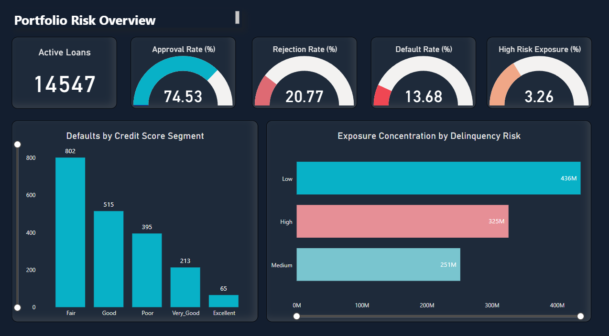
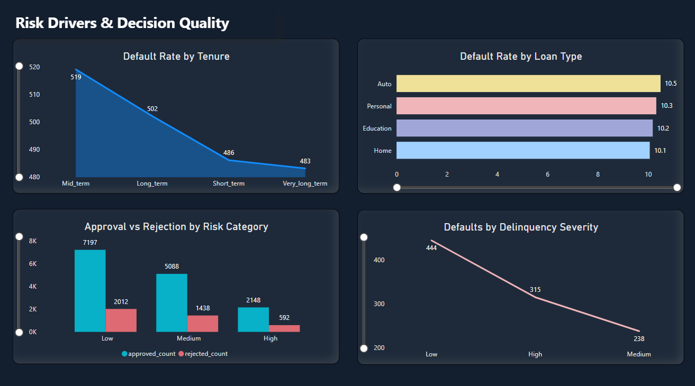

# End-to-End Loan Portfolio Risk Analytics
This project presents an end-to-end analysis of a bank’s loan portfolio with the objective of assessing credit risk, exposure concentration, and decision quality. Using Excel for data creation & cleaning, SQL for data modeling and analysis and Power BI for visualization, the project provides both an executive-level risk overview and a deeper diagnostic view into the drivers of loan defaults and early warning signals.

## Project Objective

The goal of this project is to understand the risk profile of a bank’s loan portfolio from a practical business perspective. 
The analysis focuses on:
- Evaluating overall portfolio risk and exposure concentration
- Identifying the key factors driving loan defaults across different customer and loan segments
- Assessing whether loan approval decisions are aligned with underlying risk levels
- Highlighting early warning signals that appear before loans move into default

## Tools & Technologies Used

- **Excel** – Used for initial data review, understanding the dataset structure, and creating a data dictionary  
- **SQL** – Used for database design, joins, aggregations, cte, subquery and multi-layer analysis of loan risk and performance  
- **Power BI** – Used to build interactive dashboards for portfolio-level overview and diagnostic analysis  

## Data Model Overview

The database schema and table relationships are documented in the ER diagram available [here](data_model/er_diagram.pdf).

Primary and foreign keys were defined to maintain referential integrity, ensuring consistency across customer, loan, and payment records. An ER diagram was created before analysis to validate table relationships and data flow.

### Core Tables

- Customers  
- Loan Applications  
- Loans  
- Payments  
- Loan Defaults  
- Risk Assessment

## Dashboard Overview

The Power BI dashboard is structured into two pages, each serving a distinct analytical purpose.

### Page 1: Portfolio Risk Overview
This page provides an executive-level snapshot of the loan portfolio. It highlights portfolio size, approval and default rates, and exposure concentration across risk segments. The focus is on understanding how risky the portfolio is and where the bank’s outstanding exposure is concentrated.

### Page 2: Risk Drivers & Decision Quality
This page dives deeper into the drivers behind portfolio risk. It analyzes default behavior across loan tenure and loan types, evaluates approval versus rejection patterns by risk category, and examines delinquency severity to identify early warning signals before default.

## Key Insights

1. Portfolio risk is concentrated in specific segments rather than being evenly spread across the portfolio. Defaults are disproportionately higher in lower credit score segments, while a significant portion of outstanding exposure is associated with loans already showing delinquency signals. This indicates concentration risk rather than broad-based portfolio deterioration.

2. Loan tenure has a noticeable impact on default behavior. Longer-tenure loans show higher default risk compared to short- and mid-term loans, suggesting that extended repayment horizons increase the likelihood of payment stress over time.

3. Default risk remains broadly consistent across loan categories, making default rates an unreliable indicator of relative loan performance.

4. Approval volumes remain significant even within higher-risk categories. While rejection rates increase with risk, a meaningful number of high-risk applications are still approved, indicating potential trade-offs between growth and risk control in lending decisions.

5. Payment delinquency emerges as a strong early warning signal for default. Loans with higher delay severity show a clear increase in default incidence, indicating that monitoring payment behavior can help identify stressed accounts well before formal default occurs.

## Business Recommendations

1. Tighten controls where risk is concentrated  
Focus on credit score bands and early delinquency accounts with closer monitoring, adjusted limits, and proactive action.

2. Re-think long-tenure loans  
Longer repayment periods carry higher risk — apply stricter eligibility, risk-based pricing, and stronger review checks.

3. Strengthen approvals for high-risk cases  
Align approvals with risk appetite by adding safeguards like higher collateral, premium pricing, or secondary sign-offs.

## Project Structure

```text

├── README.md
├── sql/
│   ├── schema.sql
│   └── analysis_queries.sql
├── powerbi/
│   ├── dashboard.pbix
│   └── screenshots/
│       ├── page1.png
│       └── page2.png
└── data_dictionary.md

```

## Dashboard Preview

### Page 1: Portfolio Risk Overview


### Page 2: Risk Drivers & Decision Quality


## Assumptions & Notes

- The analysis is based on past loan, payment, and default records.

- Default rates are treated as general signs of risk, not exact predictions.

- We assume all loan types were approved under similar rules.

- The findings depend on the data available and the level of detail it provides.


  


